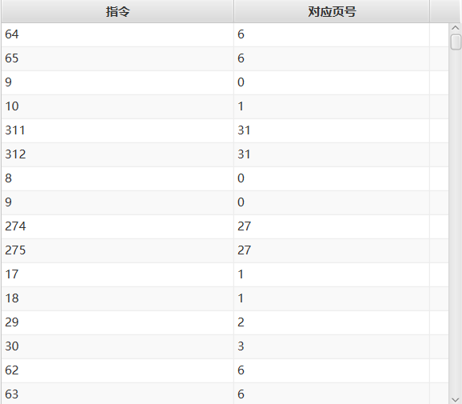
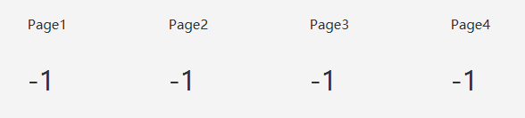
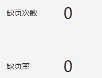
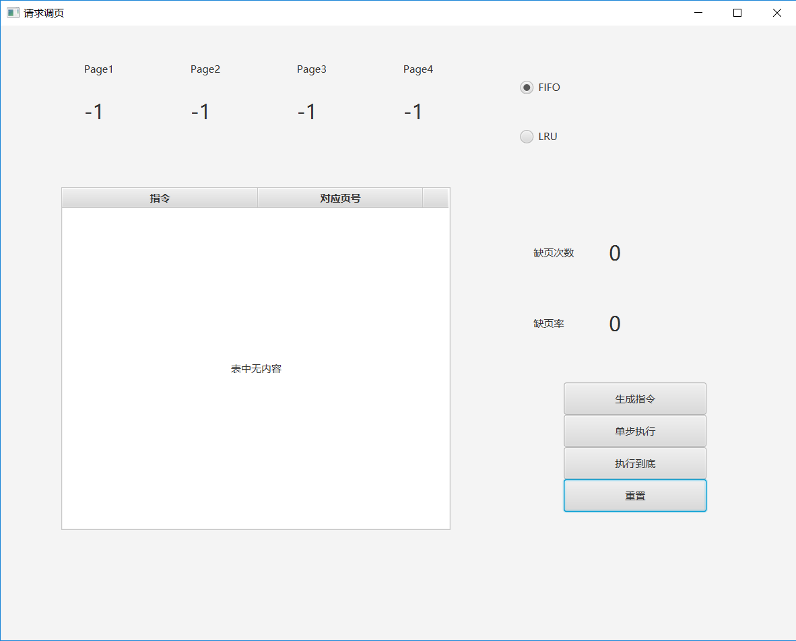
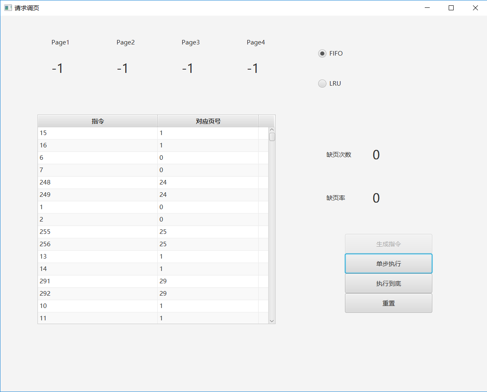
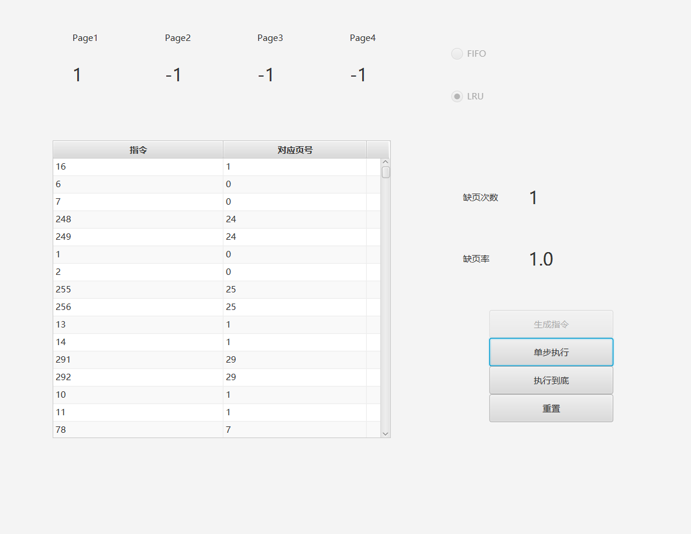
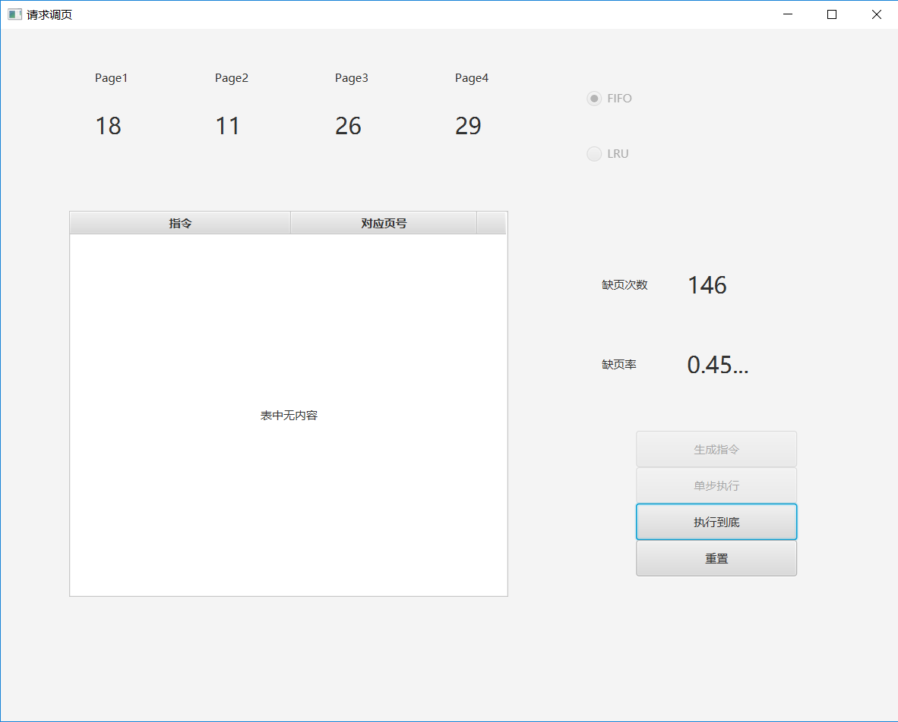

# 请求调页设计方案报告

**1652613 白皓月**

开发语言为java，界面基于javafx构建

## 项目背景

编写一个程序，模拟请求调页存储管理方式，一共有320条指令，假设每个页面可以存放10条指令，分配的作业有4个内存块，模拟该作业的执行过程，采用FIFO算法或LRU算法来实现置换。

本项目的基本情况如下：

- 指令：共320条指令
- 页面：每个页面存放10条指令，即有32个页
- 内存：该作业的内存块有4块
- 指令分布：
  - 50%顺序执行
  - 25%均匀分布在前地址部分
  - 25%均匀分布在后地址部分
- 置换算法：FIFO或LRU

按照需求设计程序模拟请求调页存储管理方式：

- 在模拟过程中：
  - 如果所访问指令在内存中，则显示其物理地址，并转到下一条指令
  - 如果没有在内存中，则发生缺页，此时需要记录缺页次数，并将其调入内存
  - 如果4个内存块中已装入作业，则需进行页面置换
- 所有320条指令执行完成后，计算并显示作业执行过程中发生的缺页率
- 置换算法可以选用FIFO或者LRU算法

指令访问次序：

1. 在0－319条指令之间，随机选取一个起始执行指令，如序号为m
2. 顺序执行下一条指令，即序号为m+1的指令
3. 通过随机数，跳转到前地址部分0－m-1中的某个指令处，其序号为m1
4. 顺序执行下一条指令，即序号为m1+1的指令
5. 通过随机数，跳转到后地址部分m1+2~319中的某条指令处，其序号为m2
6. 顺序执行下一条指令，即m2+1处的指令。
7. 重复跳转到前地址部分、顺序执行、跳转到后地址部分、顺序执行的过程，直到执行完320条指令。

## 算法设计

以javafx的TableView组件展示指令序列。第一列是指令序号，第二列展示的是指令对应的页号。最上边的指令为即将执行的指令



该组件与javafx的observableList的一个实例绑定(第一行对应instruction,第二行对应pageAddress)：

```java
private ObservableList<Instruction> sequence =
            FXCollections.observableArrayList();
    public class Instruction {
        private int instruction;
        private int pageAddress;
        public Instruction(int instruction_,int pageAddress_) {
            instruction = instruction_;
            pageAddress = pageAddress_;
        }

        public int getInstruction() {
            return instruction;
        }

        public int getPageAddress() {
            return pageAddress;
        }
    }
```


点击生成指令会调用generateSequence函数，将生成的指令add入sequence中，一共有320条指令，生成指令的原则遵循题目要求

> 1. 在0－319条指令之间，随机选取一个起始执行指令，如序号为m
> 2. 顺序执行下一条指令，即序号为m+1的指令
> 3. 通过随机数，跳转到前地址部分0－m-1中的某个指令处，其序号为m1
> 4. 顺序执行下一条指令，即序号为m1+1的指令
> 5. 通过随机数，跳转到后地址部分m1+2~319中的某条指令处，其序号为m2
> 6. 顺序执行下一条指令，即m2+1处的指令。
> 7. 重复跳转到前地址部分、顺序执行、跳转到后地址部分、顺序执行的过程，直到执行完320条指令。


当前正在内存里的页用一个长度为4的队列表示：

```java
Deque<Integer> memoryPages = new LinkedList<Integer>();
```

当前内存页的显示用Label的数组`public Label[] pages = new Label[4]`。



memoryPages与pages每一个时刻存的页是一样的，但是顺序不一定相同，memoryPages的顺序是为了配合FIFO算法或者LRU算法，在头部的永远是即将最先被替换的。


## FIFO算法

选择fifo算法后，每点击一次单步执行按钮，都会执行一次singleFifo函数，函数会首先将当前指令的页号取出。（后续会将此头部元素删除）

``` javascript
int page = sequence.get(0).getPageAddress();
```

如果当前内存里没有这个页，即`!memoryPages.contains(page)`，执行相应的核心算法：

```java
            //Platform.runLater是为了配合执行到底时，因为runToEnd是另一个线程
            if(memoryPages.size() < 4) {
                memoryPages.offer(page);
                Platform.runLater(()-> {
                    pages[pageIndex].setText(Integer.toString(page));
                    pageIndex = (pageIndex + 1) % 4;
                });

            } else if(memoryPages.size() == 4) {
                memoryPages.poll();
                memoryPages.offer(page);
                Platform.runLater(()-> {
                    pages[pageIndex].setText(Integer.toString(page));
                    pageIndex = (pageIndex + 1) % 4;
                });
            }
```

因为FIFO算法，先进来的肯定是先被替换。memoryPage是个队列，只需要在size为4的时候将头部poll出去，将新的offer进来。pageIndex也只需要循环余4加一即可。


## LRU算法

和FIFO算法类似，选择LRU算法后，每点击一次单步执行按钮，都会执行一次singleLRU函数，函数会首先将当前指令的页号取出。(后续会将此头部元素删除)

```java
int page = sequence.get(0).getPageAddress();
```

如果当前内存里有这个页的话，算法会将memoryPages里的这一页移动到尾部，表示最近使用过，最近最久未被使用的是在头部即将被替换的。

```java
        if(memoryPages.contains(page)) {
            memoryPages.remove(page);
            memoryPages.offer(page);
        } else {
            if(memoryPages.size() < 4) {
                memoryPages.offer(page);
                Platform.runLater(()-> {
                    pages[pageIndex].setText(Integer.toString(page));
                    pageIndex = (pageIndex + 1) % 4;
                });
            } else if(memoryPages.size() == 4) {
                int poll = memoryPages.poll();
                Platform.runLater(()-> {
                    for(int i = 0; i < 4;i++) {
                        if(pages[i].getText().equals(Integer.toString(poll))) {
                            pages[i].setText(Integer.toString(page));
                        }
                    }
                });
                memoryPages.offer(page);
            }
        }

```

如果当前内存里没有这个页，即`!memoryPages.contains(page)`，当内存没有满时处理方法与FIFO算法一样，区别体现在替换时。因为这时即将被替换的不是最先进来的，不能像FIFO算法一样按照顺序去修改替换pages。但是memoryPages队列的头部依然是最先被替换的，是最近最久未被使用的。所以将队列头部poll出来，然后循环扫描pages找到对应的Label并修改替换即可。

## 执行到底

考虑到320条指令较多，所以加入执行到底功能。可以在生成指令后直接点击执行到底，也可以在单步执行若干次后再点击执行到底。执行到底本可以按一下直接显示最终结果，但是这样可能就没办法显示中间过程。于是我将执行到底的函数新开了一个线程，每执行一步线程会sleep(50)。按下执行到底就会执行这个线程。线程的核心函数如下：

```java
        public void run() {
            while(sequence.size() != 0) {
                if (fifo.isSelected()) {
                    singleFifo();
                } else if (lru.isSelected()) {
                    singleLru();
                }
                single.setDisable(true);
                sequence.remove(0);
                table.setItems(sequence);
                try {
                    Thread.sleep(50);
                }
                catch(Exception exc){
                    System.out.println("sleep exception!!");

                }
            }
        }
```

singleFifo和singleLru的Platform.runlater()也正是因为这两个函数可能在另一个线程而不再UI线程执行，所以必须加上runlater()才能成功更新UI。


## 缺页次数和缺页率

每次执行singleFifo函数或者singleLru函数，都会计算指令总条数和缺页次数

```java
        if(memoryPages.contains(page)) {
            allNum++;
            return;
        } else {
            faultNum++;
            allNum++;
            ...
        }
```

在这两个函数最后也都会更新UI组件，faultNumber和faultRate都是相应的Label组件：

```java
        Platform.runLater(()-> {
            faultNumber.setText(Integer.toString(faultNum));
            faultRate.setText(Double.toString((double)faultNum/allNum));
        });
```




## 重置

点击单步执行后，选择算法就处于Disable状态，生成指令按钮也处于Disable状态。


点击执行到底后，以上按钮和单步执行按钮也都会处于Disable状态，防止出现混乱。

但是点击重置后，所有按钮都会恢复。memoryPages，table组件，pages，缺页次数和缺页率等值都会回到初始值。可以开始新一轮的模拟。

## 展示




初始界面如图，page为-1表示还没有页调入。先要点击生成指令：



选择算法后，即可点击单步执行后者执行到底，点击单步执行后列表的头部的指令就poll出去，相应的页也被调入内存：



某一次生成指令选择LRU执行到底后：


某一次生成指令选择FIFO执行到底后：

